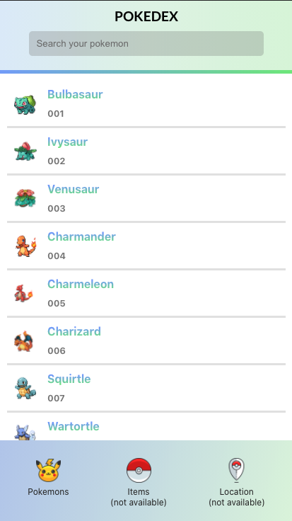

# 🎮👾 Pokedex created with React.js

Very simple application consisting of fetching from a couple of public APIs with React.js

Find the deployment here: https://pokedex-reactjs-manusanchez.netlify.app

Copyright: Some icons, mainly the ones concerning the pokeball, and all the elements in the footer are property of [Roundicons Freebies](http://www.roundicons.com/).
